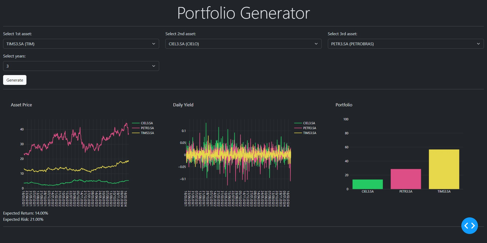

# Portfolio Generator

Este documento está disponível em [Inglês](README-en.md), porém também está disponível em [Português](README-en).

## Visão Geral

Este projeto apresenta uma aplicação projetada em torno da teoria de portfólio, oferecendo aos usuários a capacidade de selecionar até três ativos financeiros e especificar o período de análise em anos. Utilizando técnicas de otimização não linear no índice de Sharpe, a aplicação gera dashboards interativos que mostram insights detalhados sobre os ativos selecionados, incluindo desempenho histórico e alocação de ativos, além do retorno e risco esperado do portfólio.

## Teoria de Portfólio

A teoria de portfólio é um dos pilares da finança moderna, focando na otimização da alocação de ativos para maximizar os retornos esperados enquanto minimiza os riscos associados. Introduzida por Harry Markowitz na década de 1950, esta teoria revolucionou a gestão de investimentos ao demonstrar os benefícios da diversificação, ilustrando como um portfólio bem diversificado pode mitigar o risco global sem sacrificar os retornos potenciais. Para uma exploração mais aprofundada, consulte o artigo seminal de Markowitz: "Seleção de Portfólio" (Markowitz, H. (1952). Seleção de Portfólio. The Journal of Finance, 7(1), 77-91).

## Tecnologias


## Captura de Tela de Exemplo



## Como Usar

1. Certifique-se de que o Docker esteja instalado em sua máquina.
2. Clone este repositório para o seu ambiente local.
3. Navegue até o diretório do projeto.
4. No terminal, execute o seguinte comando para construir e iniciar o contêiner Docker:
    - No Linux, execute:
        ```bash
        docker compose up
        ```

    - No Windows, execute:
        ```bash
        docker-compose up
        ```

5. Após a construção do contêiner e a inicialização da aplicação, acesse [http://localhost:8050](http://localhost:8050) em seu navegador da web para explorar o Dashboard de Otimização de Portfólio.

**Observação:** 
- Certifique-se de que a porta `8050` não está sendo utilizada por outra aplicação em seu sistema para evitar conflitos. Se necessário, você pode modificar o mapeamento de porta no arquivo [docker-compose.yaml](docker-compose.yaml).

## Referências

- Markowitz, H. (1952). Seleção de Portfólio. The Journal of Finance, 7(1), 77-91.
